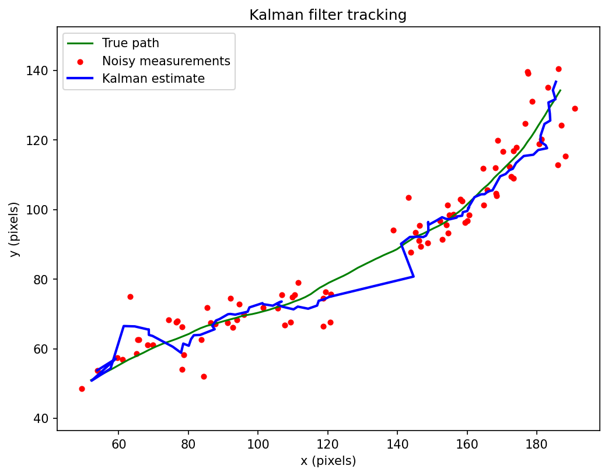

# Kalman Filter for 2D Object Tracking

A from-scratch implementation of a Kalman filter for tracking a moving object in 2D, built to understand state estimation for object tracking. The filter is implemented directly in NumPy, without a tracking library, so each step is explicit. It is demonstrated on simulated data with known ground truth, which allows the tracking error to be measured rather than only shown.

This is a learning implementation on synthetic data, not real footage. It is the foundation for a follow-on project applying the same filter to real microscopy video.

## What it does

An object moves through a 2D field with roughly constant velocity and small random disturbances. A noisy detector reports its position each frame. The Kalman filter takes only those noisy measurements and estimates the true path, using a constant-velocity motion model. It also handles a stretch of frames where detection fails, coasting on prediction alone until measurements return.

## Result

On 100 frames with measurement noise of 5 pixels and a 15-frame detection dropout:

- RMSE of raw measurements against the true path: 6.99 pixels
- RMSE of the Kalman estimate against the true path: 4.07 pixels

The filter reduced tracking error by about 42%, and this figure includes the dropout period, where the estimate necessarily drifts because it has no measurements to correct against.

The green line is the true path. Red dots are the noisy measurements the filter receives; they disappear during the dropout. The blue line is the filter's estimate. During the dropout the blue line coasts in a straight line on the constant-velocity model, drifts slightly from the curving truth, then snaps back toward the measurements when detection returns.

## How it works

The filter tracks four numbers: position (x, y) and velocity (vx, vy). Each frame it runs two steps. Predict advances the state using the motion model; update corrects it toward the measurement, trusting the measurement more when the filter is uncertain and less when the measurement is noisy.

When detection fails, the update is skipped and the filter runs on prediction alone. This maintains a continuous track through the gap, which raw detection cannot do.

## What this demonstrates and its limits

The implementation shows the core of Kalman filtering: motion modelling, combining a prediction with a noisy measurement by weighting each according to its uncertainty, and maintaining a track through missing detections.

The main limitation is visible in the dropout: the filter coasts in a straight line, so it handles short gaps and smooth motion well, but drifts through a long dropout or one that occurs while the object is turning, because a constant-velocity model cannot account for motion it did not observe. Tracking accuracy also depends on tuning the process noise and measurement noise, which set the balance between smoothness and responsiveness.

## Files

- `simulation.py` the full implementation
- `kalman_tracking_dropout.png` the tracking result
